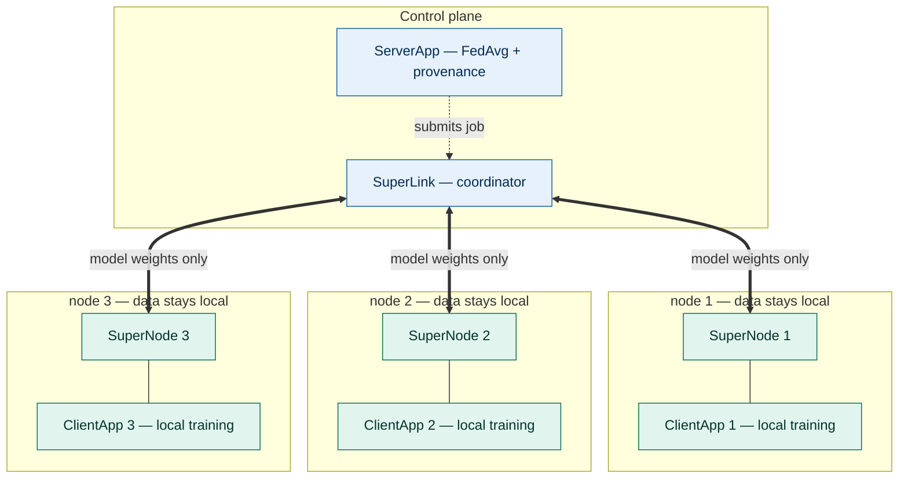
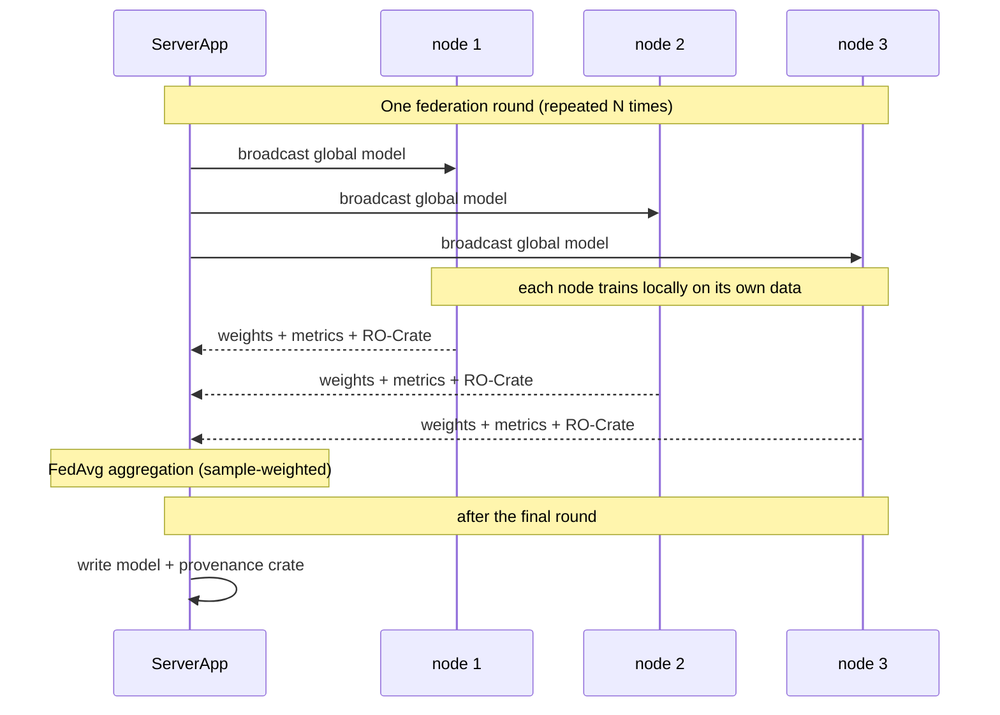

# Federated PRS Learning with Provenance Capture

A reference implementation of **privacy-preserving federated learning across
data stored by different organisations/environments)**, with **automated, machine-readable
provenance** of both the computation and the participating institutions.

Three nodes each hold a genetics cohort that cannot leave its environment. They
collaboratively train a shared model to predict disease case/control status
from polygenic risk score (PRS) variants — **without any patient-level data
ever crossing a node boundary**. Only model weights are exchanged. The run emits
a single [RO-Crate](https://www.researchobject.org/ro-crate/) documenting *what
was run, with which software and configuration, and which institutions
contributed*.

Built on the [Flower](https://flower.ai/) framework (Message API) and the
[Federated Learning RO-Crate
profile](https://esciencelab.org.uk/federated-learning-ro-crate-profile/).

> **Status.** This is an academic deliverable — one milestone in ongoing work.
> It is a working demonstration intended for reuse and extension, not a
> production system. See [Scope and limitations](#scope-and-limitations).

---

## What this demonstrates

1. **Federated learning across nodes with the Flower Message API.** A real
   client/server deployment (SuperLink + SuperNodes), not a single-process
   simulation. Each node runs in isolation with only its own data mounted.

2. **Two-source provenance, merged into one record.** Every run produces an
   RO-Crate that combines:
   - *Computational provenance* — captured automatically: the Flower run, the
     aggregation strategy and its hyperparameters, every framework with its
     declared **and** installed version, the run configuration, per-round and
     final metrics, and start/end timing.
   - *Institutional provenance* — each node supplies its own RO-Crate
     (organisation, [ROR](https://ror.org/) identifier, geolocation); these are
     folded into the run-crate as **contributors** on the run action.

   The result is a self-contained, FAIR provenance record linking the
   computation to the institutions whose data backed it.

---

## How it works

### Deployment topology

The system runs as a set of containers: a central control plane and one
isolated pair of containers per node. Only model weights cross the boundary
between the control plane and each node — patient data never leaves.



### What happens each round

Each federation round, the server broadcasts the current global model; each node
trains locally on its private cohort and returns updated weights plus metrics
(and its RO-Crate); the server aggregates the weights with FedAvg. After the
final round, the server writes the model and the merged provenance crate.



**The model.** Logistic regression (`SGDClassifier`, log-loss) over 313 SNP
dosages, predicting `case`/control. Class weighting handles the ~1–2% case
prevalence; metrics are macro-averaged. The ML code lives entirely in
`prs_fed/task.py` and is independent of Flower — swap it out to federate a
different model.

---

## Quick start

### Prerequisites

- Docker + Docker Compose
- The `flwr` CLI on your host: `pip install "flwr>=1.29"`
- Three cohort CSVs (see [Data format](#data-format)) placed in `data/`, synthetic data files have been made available for this demo through git lfs. If you have git lfs installed (`git lfs install`) first, data files will be pulled automatically, but alternatively you can install git lfs after cloning and simply run `git lfs pull` within the cloned repository.
- The `flwrcrate` provenance module at `prs_fed/flwrcrate/`. Please clone the following commit hash to ensure the demo works as intended (this will be updated once the module is published on PyPI): https://github.com/eScienceLab/flwrCrate/tree/1acd351f481b9473e785ae2fee68ad8640c14789 

### Run

```bash
# 1. Register the SuperLink connection with the Flower CLI (once per machine)
./scripts/setup_federation.sh

# 2. Start the federation platform (stays running; serves many jobs)
docker compose up --build -d

# 3. Submit a federation job
flwr run . local-deployment --stream

# 4. When finished, tear down
docker compose down -v
```
Step 1 is a one-time setup per machine. Flower (version 1.26 and later) stores
SuperLink connection settings in a user-level configuration file
(`~/.flwr/config.toml`) rather than in the project, so a freshly cloned
repository must register its connection once before `flwr run` can submit jobs.
The script adds a `local-deployment` connection pointing at the local
deployment and is safe to run more than once. To register it manually instead,
add the following to `~/.flwr/config.toml`:
 
```toml
[superlink.local-deployment]
address  = "127.0.0.1:9093"
insecure = true
```
 
Verify the connection with `flwr config list`.
 
The platform started by `docker compose up` stays running and can serve many
successive jobs. After changing any code under `prs_fed/`, rebuild the images
with `docker compose up --build -d` before submitting the next job.


Outputs appear in `./results/`:

```
results/
├── prs_global_model.pkl      # trained sklearn model (predict_proba-ready)
├── prs_global_weights.npz    # raw coef + intercept
├── training_history.json     # per-round, per-node metrics
└── fl_crate/
    └── ro-crate/
        └── ro-crate-metadata.json   # the provenance crate (nodes merged in)
```

### Configure a run

Defaults live in `pyproject.toml` under `[tool.flwr.app.config]`. Override any
of them per-run without editing the file:

```bash
flwr run . local-deployment --stream \
  --run-config "num-server-rounds=20 local-epochs=10 author-name='Jane Doe'"
```

| Key | Default | Meaning |
|---|---|---|
| `num-server-rounds` | 10 | Federation rounds |
| `local-epochs` | 5 | Local training passes per round per node |
| `n-features` | 313 | SNP feature count (must match the data) |
| `threshold` | 0.5 | Classification decision threshold |
| `author-name` / `author-orcid` / `author-affiliation` | "" | Provenance author (set these for a complete crate) |

---

## Data format

Each node's CSV holds one row per patient with:

- **313 SNP dosage columns** — any column whose name contains `:` is treated as
  a SNP feature (dosage 0/1/2). Adjust `n-features` if your panel differs.
- **`case`** — binary target (0 = control, 1 = case).
- Other columns (age, sex, etc.) are ignored by the current model.

Place the three CSVs in `data/` and reference them in `compose.yml` (already
wired for `USA_young.csv`, `USA_old.csv`, `USA_normal.csv`). Each is mounted
read-only into only its own node's container.

> The demonstration cohorts are deliberately **age-imbalanced** across nodes to
> show that federation produces a balanced global model even when no single
> node holds representative data.

---

## Provenance in detail

### Per-node crates (institutional provenance)

Each node supplies an RO-Crate at `provenance/<cohort>/ro-crate-metadata.json`,
mounted into its container at a fixed path. A minimal crate is a flat JSON-LD
`@graph`: a root `Dataset` whose `about` points to an `Organization` (with a
ROR id as its `@id`), whose `location` points to a `GeoCoordinates` entity with
a nested `PostalAddress`. See the bundled examples for the exact shape.

If a node's crate is missing or malformed, that node is logged and **the
federation still runs** — provenance is best-effort, never a hard dependency.

> **Docker bind-mount caveat.** Each crate file must exist on the host *before*
> `docker compose up`. Docker mounts a single file by path; if it doesn't
> exist, Docker creates a *directory* there instead and the container breaks.
> The bundled files cover the three demo nodes; this only matters if you add a
> node or delete a file.

### Run-crate (computational provenance)

The [`flwrcrate`](prs_fed/flwrcrate/) module wraps the run and emits the
computational provenance automatically. The per-node Organizations are then
merged into that crate as `contributor`s on the run's `CreateAction`
(`prs_fed/crate_merge.py`). Institutions that share a ROR id are de-duplicated.

### Validation

The crate targets RO-Crate 1.2 and the FL profile. It validates with
[`rocrate-validator`](https://github.com/crs4/rocrate-validator); note that a
single `MUST 5.3` (`conformsTo` version) finding is an expected false positive
where the validator ships only a 1.1 profile — all other REQUIRED checks pass.

---

## Reusing this for your own federated learning

The project is structured so the parts you'd replace are isolated from the
federation/provenance machinery.

**To federate a different model:** edit only `prs_fed/task.py`. It defines the
model, parameter (de)serialisation, local data loading, and evaluation — all in
plain sklearn/NumPy with no Flower dependency. As long as
`get_parameters`/`set_parameters` round-trip a list of NumPy arrays, the rest
of the pipeline is unchanged.

**To use a different aggregation strategy:** `prs_fed/strategy.py` subclasses
Flower's `FedAvg` only to record per-node history. Swap the base class for
`FedProx`, `FedAdam`, etc., or drop the subclass entirely and instantiate the
built-in strategy in `prs_fed/server_app.py`.

**To change the number of nodes:** add or remove `supernode-N` / `clientapp-N`
service pairs in `compose.yml`, update `min_train_nodes` (and the related
minimums) in `server_app.py`, and provide each new node's CSV and crate.

**To add provenance to a different Flower app:** the `flwrcrate` integration is
three touchpoints in your ServerApp — a context manager around
`strategy.start(...)`, and a `record_result(...)` call. See `server_app.py` and
the module's own README. The node-crate merge (`crate_merge.py`) is independent
and reusable: give it a run-crate path and a dict of per-source crates.

**Key files**

| File | Responsibility |
|---|---|
| `prs_fed/task.py` | The ML: model, data loading, evaluation (no Flower) |
| `prs_fed/client_app.py` | node-side: train/evaluate handlers, loads local crate |
| `prs_fed/server_app.py` | Orchestration: runs the federation, writes outputs |
| `prs_fed/strategy.py` | FedAvg subclass that records per-node history |
| `prs_fed/provenance.py` | Load / validate / summarise an RO-Crate |
| `prs_fed/crate_merge.py` | Merge per-node crates into the run-crate |
| `prs_fed/model_io.py` | Persist model, weights, history |
| `compose.yml` | The 7-container deployment topology |

---

## Project structure

```
.
├── pyproject.toml              Flower App manifest + run config + metric URIs
├── compose.yml                 SuperLink + ServerApp + 3×(SuperNode+ClientApp)
├── prs_fed/
│   ├── task.py                 ML logic (model, data, metrics)
│   ├── client_app.py           node-side train/evaluate
│   ├── server_app.py           Orchestration + provenance wiring
│   ├── strategy.py             HistoryFedAvg
│   ├── provenance.py           RO-Crate load/validate/summarise
│   ├── crate_merge.py          Merge node crates into the run-crate
│   ├── model_io.py             Output persistence
│   └── flwrcrate/              Provenance-capture module (bundled)
├── data/                       node cohort CSVs (you provide)
│   ├── USA_young.csv
│   ├── USA_old.csv
│   └── USA_normal.csv
├── provenance/                 Per-node RO-Crates
│   ├── USA_young/ro-crate-metadata.json
│   ├── USA_old/ro-crate-metadata.json
│   └── USA_normal/ro-crate-metadata.json
└── results/                    Outputs (created on first run)
```

### The deployment topology

`docker compose up` starts seven containers:

- **`superlink`** — the control plane; stays up across many jobs.
- **`serverapp`** — runs the ServerApp (orchestration + provenance) when a job
  is submitted.
- **`supernode-1..3`** — one persistent supervisor per node; connects out to the
  SuperLink.
- **`clientapp-1..3`** — one executor per node; runs the actual training. Only
  these mount the node's CSV and crate.

The SuperNode/ClientApp split is Flower's process-isolation model: the
SuperNode stays alive across rounds while ClientApp processes are short-lived.

---

## Loading the trained model

```python
import pickle, numpy as np

with open("results/prs_global_model.pkl", "rb") as f:
    model = pickle.load(f)

# X must be standardised the same way as during training (StandardScaler)
probs = model.predict_proba(X_scaled)[:, 1]
preds = (probs >= 0.5).astype(int)
```

Or load the raw weights from `prs_global_weights.npz` (`coef`, `intercept`).

---

## Scope and limitations

This is a milestone demonstration. Known boundaries, stated plainly for
reviewers:

- **No differential privacy or secure aggregation.** Only model weights cross
  node boundaries, but weights can in principle leak information about training
  data. Production deployments would add DP-SGD or secure aggregation (both
  supported by Flower as additions).
- **No TLS by default.** The compose setup runs on a private Docker network in
  plaintext. Cross-machine deployment requires enabling Flower's TLS.
- **Demonstration data.** Cohorts share a generative process and differ only in
  age distribution; they are not genetically distinct populations. Real
  cross-ancestry federation needs population-stratification handling.
- **Per-client metadata is out of scope by design.** Flower exposes only
  per-round aggregates, consistent with the privacy premise.
- **Single-machine by default.** The topology runs across one host via Docker;
  multi-host deployment is a configuration change (SuperLink address + TLS),
  not a code change.

---

## Acknowledgements

Built on [Flower](https://flower.ai/), [RO-Crate](https://www.researchobject.org/ro-crate/),
and the [Federated Learning RO-Crate
profile](https://esciencelab.org.uk/federated-learning-ro-crate-profile/).
Provenance capture uses the `flwrcrate` module, both the RO-Crate and flwrcrate packages were developed by the University of Manchester's eScience lab (https://esciencelab.org.uk).
